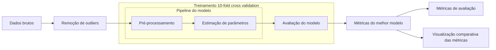
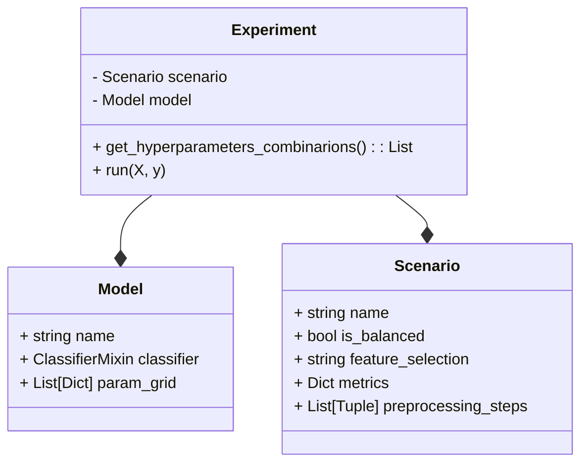

# SIN5007 Reconhecimento de padrões

[Link para apresentação](https://docs.google.com/presentation/d/1y-lzXKcS2_UlgfjSSH7n2GR3K5IyFCK4GlZ10-nf4y4/edit#slide=id.p)


## Estrutura do repositório
```
├── data
│   ├── preprocessed            -- Dados intermediários (pre-processados)
│   ├── results                 -- Resultados
│   └── raw                     -- Dados brutos
├── docs                        -- Documentações do projeto e datasets
├── notebooks                   -- Experimentos em jupyter notebooks
├── outputs                     -- Visualizações de dados
├── src                         -- Scripts utilizados
│   ├── dataviz                 -- Scripts de visualização de dados
│   ├── evaluation              -- Validação cruzada e métricas
│   ├── features                -- Remoção de outliers e train test split
│   ├── train                   -- Treinamento de modelos
│   └── toolbox                 -- Funções auxiliares
├── README.md
├── requirements.txt            -- Bibliotecas necessárias
└── setup.py                    -- Arquivo de configuração do python
```

## Como contribuir

### Linux
```
$ python3 -m venv venv
$ . venv/bin/activate
$ pip install -r requirements
```

## Pipeline
A seguinte pipeline é executada para cada cenário de pré-processamento e modelo implementados.


# Organização do código e como rodar

## Classes


## Para rodar
Todo modelo e cenário de pré-processamento é reaproveitável, para incluir um novo cenário de pré-processamento basta incluir sua classe Scenario em `src/train/scenarios.py`, do mesmo modo para incluir um novo modelo basta adicionar sua classe Model em `src/train/models.py`.

Para testar os modelos em todos os cenários, basta rodar no terminal:
```shell
$ python src/train/train.py
```


## Contributors

@cabertoldi @igabid @ngalindojr @itsmeale